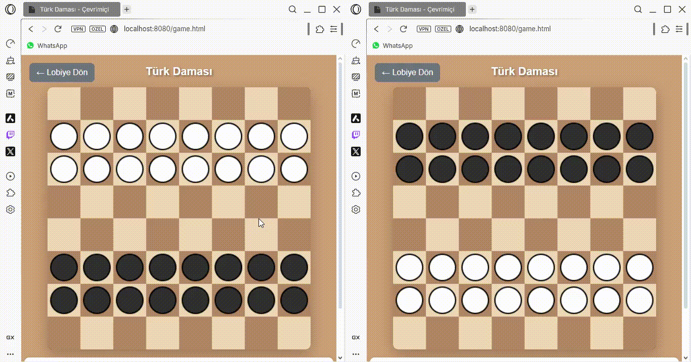
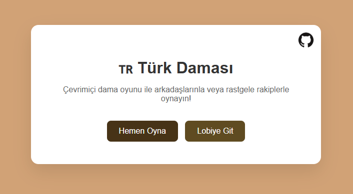
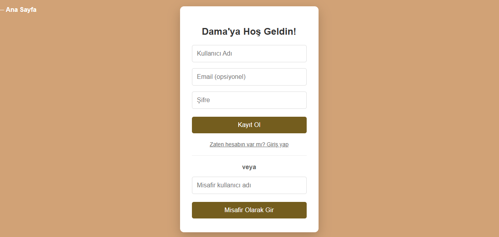
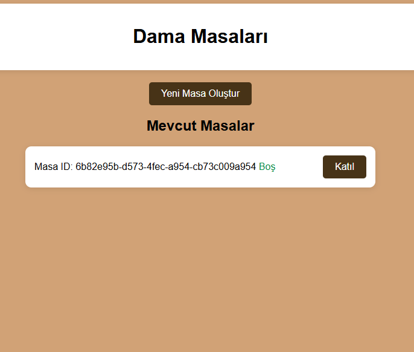

# 🇹🇷 Türk Daması - Çevrimiçi



Türk Daması’nı çevrimiçi oynayın! Kayıt olun, misafir girişi yapın, masa oluşturun veya katılın, gerçek zamanlı oynayın.

 |  | 

[](https://nodejs.org/) [](https://opensource.org/licenses/ISC)

## Özellikler
- Kayıt, giriş, misafir girişi (JWT, bcrypt).
- Lobi: Masaları listele, oluştur, katıl.
- Oyun: Canvas tahta, WebSocket ile anlık hamleler, yeme zorunlu, dama olma.
- MySQL: Kullanıcı ve masa verileri.

**Uyarı:** `server.js`'de hardcoded MySQL şifresi (`yourpassword`) ve JWT secret (`dama-secret-key-2024`) var. Güvenlik için bunları değiştirin veya `.env` kullanın!

## Gereksinimler
- Node.js (v18+)
- MySQL (v8+)

## Bağımlılıklar
`package.json`'dan:
- `bcrypt: ^6.0.0`
- `bcryptjs: ^3.0.2`
- `cors: ^2.8.5`
- `dotenv: ^17.2.3`
- `express: ^5.1.0`
- `express-session: ^1.18.2`
- `jsonwebtoken: ^9.0.2`
- `multer: ^2.0.2`
- `mysql2: ^3.14.5`
- `uuid: ^13.0.0`
- `ws: ^8.18.3`

## Kurulum
1. **Repo'yu Klonla:**
   ```
   git clone https://github.com/selahaddineyyuberdogan/onlinedama.git
   cd onlinedama
   ```

2. **Bağımlılıkları Yükle:**
   ```
   npm install
   ```

3. **MySQL Kurulumu:**
   - MySQL'i kurun (örn: XAMPP).
   - Boş veritabanı oluştur:
     ```sql
     CREATE DATABASE dama_db;
     ```
   - Tabloları otomatik oluştur: `npm start` ile server çalıştırıldığında tablolar (`users`, `tables`) oluşur.
   - Manuel isterseniz:
     ```sql
     CREATE TABLE users (
         id VARCHAR(36) PRIMARY KEY,
         username VARCHAR(50) UNIQUE NOT NULL,
         email VARCHAR(100) UNIQUE,
         password VARCHAR(255) NOT NULL,
         is_guest BOOLEAN DEFAULT FALSE,
         created_at TIMESTAMP DEFAULT CURRENT_TIMESTAMP
     );

     CREATE TABLE tables (
         id VARCHAR(36) PRIMARY KEY,
         game_state TEXT,
         status ENUM('open', 'full', 'playing', 'finished') DEFAULT 'open',
         created_at TIMESTAMP DEFAULT CURRENT_TIMESTAMP
     );
     ```
   - `server.js`'de `host: 'localhost'`, `user: 'root'`, `password: 'yourpassword'`, `database: 'dama_db'` ayarlarını kendi MySQL bilgilerinize göre güncelleyin.

4. **Server'ı Çalıştır:**
   ```
   npm start
   ```
   - http://localhost:8080 açılır.

5. **Oyna:**
   - Ana sayfa: `/`
   - Giriş/Kayıt: `/login.html`
   - Lobi: `/lobby.html`
   - Oyun: `/game.html?table=ID`

## Kullanım
- **Giriş:** Kayıt olun veya misafir girişi yapın.
- **Lobi:** Masa oluşturun/katılın.
- **Oyun:** Türk Daması kuralları – piyonlar ileri/sağa/sola, yeme zorunlu, en çok yeme öncelikli, dama sınırsız hareket. Rakip taşları biterse kazanırsınız.

## İletişim
- GitHub: [selahaddineyyuberdogan](https://github.com/selahaddineyyuberdogan)
- Sorunlar için: [Issues](https://github.com/selahaddineyyuberdogan/onlinedama/issues)
- Mail: seyuperdogan4


   git add .
   git commit -m "Türk Daması projesi"
   git remote add origin https://github.com/selahaddineyyuberdogan/onlinedama.git
   git push -u origin main
   ```

Eğer truncated dosyaların tam halini verirsen, README’yi daha da özelleştirebilirim (örneğin, eksik oyun kuralları varsa). Soru varsa, kısa kes, yaz! 😄
